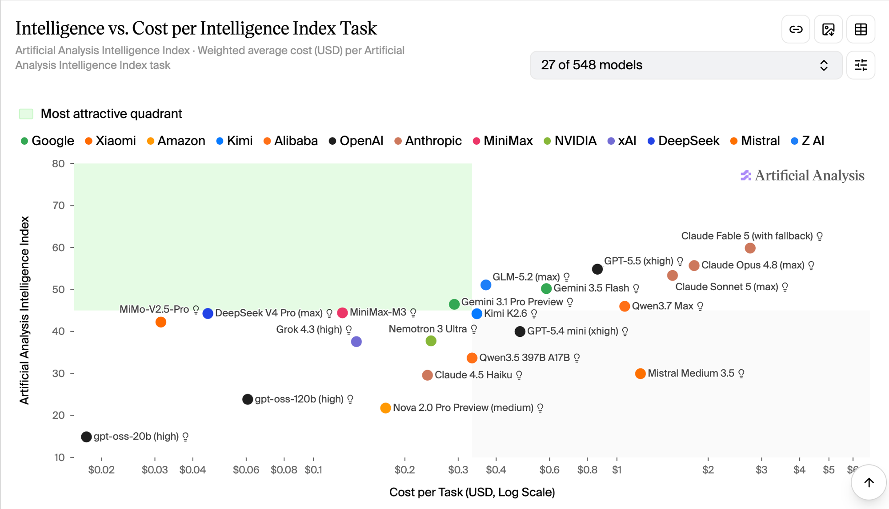
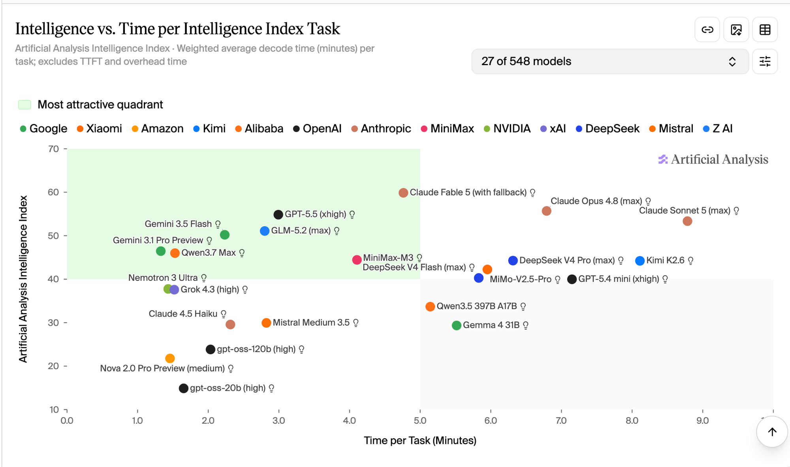
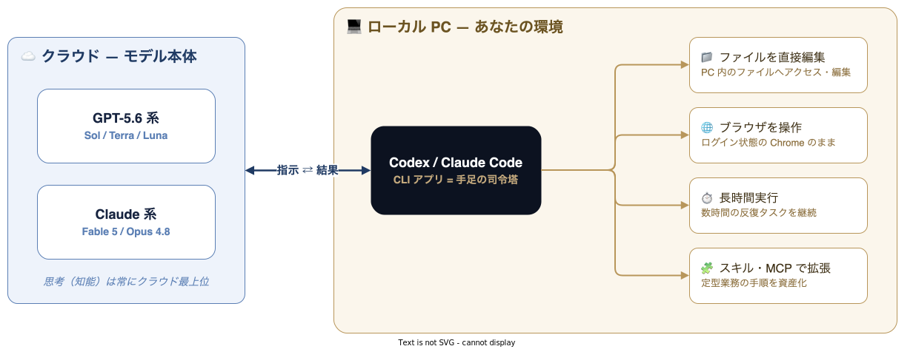

<!-- _class: lead cover -->
<!-- _paginate: false -->

スライド | 株式会社ZENSHIN

# 生成 AI ツール戦略

## 主力モデルとCLIを性能・知能・費用から選ぶ

作成日 2026.07.06

高橋 俊 CTO / 技術責任者

---

<!-- _class: center detail-list -->

# 結論から

- **🎯 現在の主力**
  - Codex + GPT-5.6 系。迷ったら Sol、速度重視なら Terra / Luna
- **🔄 Claude を併用する条件**
  - Fable 5 の利用枠を十分確保できる場合
- **📚 長期の学習投資先**
  - OpenAI / Anthropic の 2 社

> 2026年7月現在の主力は***GPT-5.6 系と Codex***

---

<!-- _class: divider -->
<!-- header: "" -->

# 業界地図 — 2 強と厚い追走

1. **業界地図 — 2 強と厚い追走**
2. GPT-5.6 と Claude を比較する
3. 世の中の AI ツールの正体
4. なぜこの 2 社が突出するのか
5. 課金戦略と副次効果

---

<!-- header: 1. 業界地図 — 2 強と厚い追走 -->

# モデルの勢力図 — 3 ティア構造

主要モデルを、学習投資の観点から 3 つのティアに分けて見ます。

| ティア | モデル系列（代表モデル） |
| --- | --- |
| **T1 — 使い込み先** | **Claude 系**（Fable / Opus / Sonnet）・**GPT-5.6 系**（Sol / Terra / Luna） |
| **T2 — 有力追走** | **Grok**（4.5）・**GLM**（5.2）・**Gemini**（3.5 Flash / 3.1 Pro） |
| **T3 — コスパ勢** | **Qwen**・**DeepSeek**・**Kimi**・**MiniMax** など |

出典: <a href="https://artificialanalysis.ai/">Artificial Analysis</a>（2026年7月10日時点。代表モデルの位置づけ）

- ***学習投資先は T1 の 2 系列***。現在の主力は GPT-5.6 系に置く
- **T2 は無視できない追走**。Grok / GLM / Gemini が実務候補に入る
- T3 は**コスパやタイパを武器に**しのぎを削る。乗り換え先の候補として見る

---

<!-- _class: center -->

# GPT-5.6 Sol の位置づけ

59

AA 指数 — Fable 5（60）に1点差、Opus 4.8（56）を上回る

$1.04

1 タスク費用 — Fable 5（$2.75）の約 3 分の 1

83 t/s

出力速度 — Fable 5（63）より高速

80

Coding Agent Index — Codex で現行トップ

出典: Artificial Analysis（artificialanalysis.ai、2026年7月10日取得）

> ***OpenAI / Anthropicの2強*** — 性能はSol 知識業務はFable 5

---

<!-- _class: center -->

# 知能だけでなくコスパでも見る

左上ほど優秀。**GPT-5.6 Sol は Fable 5 に 1 点差で、コストは約 3 分の 1**。
Opus 4.8 を上回り、GPT 系の優位が鮮明になった。

出典: Artificial Analysis — Intelligence vs. Cost（artificialanalysis.ai、2026年7月10日取得）

---

<!-- _class: center -->

# タイパ（速度）でも見る

**GPT-5.6 Sol は 83 tokens/s**。Fable 5（63）より速く、Opus 4.8 より高性能。
速度まで含めると、Sol の優位はさらに大きい。

出典: Artificial Analysis — Intelligence vs. Output Speed（artificialanalysis.ai、2026年7月10日取得）

---

<!-- _class: detail-list -->

# 我々の業務の本質は「文書作成」

AI に任せたい業務を分解すると、その大半は文書作成に行き着きます。

- **✉️ メール・企画書・報告書**
  - そのものが文書作成
- **💻 コード**
  - プログラムもテキスト。これも文書作成
- **📑 スライド生成**
  - 構成と文章が本体の文書作成
- **📈 グラフ・可視化**
  - 文書をコードで可視化したもの

> 学習投資は***OpenAI / Anthropicの2社*** — 現在の主力はGPT-5.6系

---

<!-- _class: divider -->
<!-- header: "" -->

# GPT-5.6 と Claude を比較する

1. 業界地図 — 2 強と厚い追走
2. **GPT-5.6 と Claude を比較する**
3. 世の中の AI ツールの正体
4. なぜこの 2 社が突出するのか
5. 課金戦略と副次効果

---

<!-- header: 2. GPT-5.6 と Claude を比較する -->
<!-- _class: center -->

# 現時点の推奨 — まず GPT-5.6

| 用途 | 推奨 | 判断 |
| --- | --- | --- |
| **迷ったら** | **Sol** | 最上位の知能と十分な速度 |
| **性能と速度の両立** | **Terra** | 現時点の本命・高コスパ |
| **大量反復** | **Luna** | 高速で、知能も実務水準 |
| **Claude を選ぶ条件** | **Fable 5** | 利用枠を十分確保できる場合 |

---

# GPT-5.6 系の使い分け

同じ GPT-5.6 系でも、知能と速度のバランスで 3 モデルを使い分けます。

| モデル | AA 指数 | 出力速度 | 一言でいうと |
| --- | ---: | ---: | --- |
| **Sol** | **59** | 83 t/s | とりあえずこれ。Opus 4.8 より高性能 |
| **Terra** | **55** | **164 t/s** | 性能と速度のバランスが最も良い |
| **Luna** | **51** | **211 t/s** | 速度最優先。大量処理・反復向け |
| GPT-5.5 | 55 | 76 t/s | 旧世代の参考。Opus 4.8 と競ったモデル |

出典: <a href="https://artificialanalysis.ai/">Artificial Analysis</a>（2026年7月10日時点、代表構成）

---

# Claude 系の現在地

Claude 系の現行 4 モデルを、知能・速度・現時点の評価で整理します。

| モデル | AA 指数 | 出力速度 | 現時点の評価 |
| --- | ---: | ---: | --- |
| **Fable 5** | **60** | 70 t/s | 最強。ただし価格と利用枠が課題 |
| **Opus 4.8** | 56 | 65 t/s | Claude を使うなら有力だが、Sol に劣る |
| **Sonnet 5** | 53 | 85 t/s | Terra と比べると中途半端 |
| **Haiku 4.5** | 24 | 93 t/s | 速いが知能差が大きく、優先度は低い |

出典: <a href="https://artificialanalysis.ai/">Artificial Analysis</a>（2026年7月10日時点、代表構成）

> Claudeを選ぶ理由は***Fable 5の突出した知能***

---

# GPT-5.6 と競合モデルを直接比較

価格帯の近いモデル同士を、知能・速度・タスク費用で直接比べます。

| 比較 | 知能 | 速度 | タスク費用 | 判断 |
| --- | --- | --- | --- | --- |
| **Sol / Opus 4.8** | 59 > 56 | 83 > 65 | Sol が安い | **Sol** |
| **Terra / Sonnet 5** | 55 > 53 | 164 > 85 | Terra が安い | **Terra** |
| **Luna / Haiku 4.5** | 51 > 24 | 211 > 93 | Luna が安い | **Luna** |
| **Luna / Gemini 3.5 Flash** | 51 > 50 | 211 > 162 | Luna が安い | **Luna** |

ここでの「上位」は、Artificial Analysis の**知能・出力速度・タスク費用**の同時点比較。製品機能や利用上限まで含む「完全互換」ではない。

---

# 今後の競争 — 3 つの仮説

2026 年後半の勢力図を左右しうる、3 つの論点を予想します。

| 論点 | 予想 |
| --- | --- |
| **Fable 5 の開放** | GPT-5.6 対抗で当面維持。Opus 5 登場後は縮小も |
| **Opus 5** | Sol 対抗モデルとして早期投入される可能性 |
| **Gemini** | 新モデルを急がず、OS・デザインツールへの AI 統合を優先 |

このページは発表済み事実ではなく、2026年7月時点の所感。新モデル・料金・利用枠の変更時に見直す。

---

<!-- _class: divider -->
<!-- header: "" -->

# 世の中の AI ツールの正体

1. 業界地図 — 2 強と厚い追走
2. GPT-5.6 と Claude を比較する
3. **世の中の AI ツールの正体**
4. なぜこの 2 社が突出するのか
5. 課金戦略と副次効果

---

<!-- header: 3. 世の中の AI ツールの正体 -->

# ほとんどの AI ツールは「ラッパー」

Genspark や Manus の中身は、主要モデルへ指示文を被せた「ラッパー」です。

- モデル本体が賢くなるほど、ラッパー側で工夫した指示文の価値は相対的に**目減りする**
- 実際、この 1 年でラッパー系ツールの優位性はほぼ消え、モデル選びの重要度が上がった

> 業務特化ツールを買う前に***2社 + スキルで代替できるか***を試す

---

# 有名ツールの裏側も主要モデル

名の知れたツールも、裏側では同じ主要モデルを呼び出しています。

| ツール | 裏側のモデル |
| --- | --- |
| **Microsoft 365 Copilot** | GPT-5 系 + Claude（両対応） |
| **GitHub Copilot / Cursor** | GPT / Claude / Gemini を切替 |
| **Genspark** | GPT / Claude / Gemini を並列実行 |
| **Manus** | Claude + Qwen |
| **OpenClaw**（旧 Clawdbot） | Claude ほか好きなモデルを接続 |

---

# 特化ツールとの付き合い方 — V0 の例

要所では、手軽な特化ツールへの少額課金が有効な場面もあります。

- 例: **V0**（ノーコードでシステムのプロトタイプを作るツール）
- 月 $20 程度なら、特定用途に課金する価値があるケースも

特化ツールは**すぐ新しいツールに追い抜かれ**、そこで培った使い方のノウハウが**陳腐化しやすい**。リスクを織り込んで課金額を決める。

Anthropic と OpenAI は ***1 年間トップランナーで走り抜いた実績***がある。学習投資を積み上げる先としては、この 2 社が最も安全。

---

<!-- _class: divider -->
<!-- header: "" -->

# なぜこの 2 社が突出するのか

1. 業界地図 — 2 強と厚い追走
2. GPT-5.6 と Claude を比較する
3. 世の中の AI ツールの正体
4. **なぜこの 2 社が突出するのか**
5. 課金戦略と副次効果

---

<!-- header: 4. なぜこの 2 社が突出するのか -->

# 差がつくのは「ツールの使いこなし」

2 社のモデルは、次の 3 つの仕組みで業務へ組み込めます。

| 仕組み | できること |
| --- | --- |
| **スキル** | 業務の手順・知識を読み込ませて専用処理をさせる |
| **MCP・コネクター** | Gmail・カレンダー・Excel などと直接つながる |
| **プラグイン** | 用途ごとの機能拡張 |

---

# 「Google 製品なら Gemini」は誤解

「Office と連携するなら Copilot」も、同じ構造の誤解です。

- Gmail・カレンダー・スプレッドシート・Excel などとの連携は、**MCP という標準規格**で公開されている
- 標準規格なので、**Claude でも GPT でも GLM でも同じ経路**でつながる
- 接続の設定も、**コネクターやスキルを有効化するだけ**で難しくない

> 接続先が同じなら***選定を決めるのはモデルの性能差***

---

# 「CLI 版」とは — 黒い画面ではない

CLI ＝コマンドラインインターフェース、ターミナルで動くツール形式のことです。

- Claude Code / Codex は元々**黒い画面のエンジニア向けツール**として誕生
- いまは CLI をラップした**デスクトップアプリ**からフル機能を使える
- UI/UX も洗練されており、***非エンジニアでも使いこなせる***

本資料の「CLI 版」は「**ローカル PC で動く版**」の総称。ブラウザで開く Web 版（チャット画面）との対比で使っている。

---

<!-- _class: detail-list -->

# CLI 版こそが本命 — Claude Code と Codex

Claude Code と Codex は、ローカル PC を直接動かせることで能力が変わります。

- **📁 ファイルを直接扱う**
  - ローカル PC のファイルへアクセスし、そのまま編集する
- **🌐 ブラウザを操作する**
  - PC 上のブラウザをログイン状態のまま操作する
- **⏱️ 長時間実行する**
  - 数時間のループや反復タスクを継続して進める
- **🧩 業務をスキル化・拡張する**
  - 定型手順を蓄積し、ローカルスクリプトや MCP と組み合わせる

Web ブラウザ版とは別物。***Web 版だけでは実力の半分も出ない。CLI 版の使いこなしが 2026 年の分岐点。***

---

# 「Web 版とは別物」の中身

同じモデルでも、Web 版と CLI 版では扱える範囲がまったく違います。

| | Web 版（ブラウザ） | CLI 版（ローカル） |
| --- | --- | --- |
| ファイル | 添付した分だけ | **PC 内全部を直接編集** |
| 操作 | チャット回答まで | **アプリも自分の Chrome も操作** |
| 実行時間 | 1 問 1 答が基本 | **数時間の放置実行** |
| 積み上げ | 会話ごとにリセット | **スキル・設定が資産化** |

「ローカル LLM」ではなく、***モデルはクラウド最上位のまま、手足だけがローカルに来る***。ブラウザは**ログイン認証ごと操作できる**。

---

# 構成図 — 手足だけがローカルに来る

前ページの違いを 1 枚の構成図にすると、次のようになります。

> Web 版との違いは***手足がローカルにあるかどうか***

---

# 主力は Codex、Claude も使える状態を保つ

Anthropic と OpenAI は、ツール活用のリードカンパニーです。

- 日々の主力は、**Codex + GPT-5.6 系**に置く
- Claude Code のスキルと運用知識も保ち、**Fable 5 の開放時に切り替えられる**ようにする
- ニュースとして追う範囲は、***Grok / GLM / Gemini*** まで広げる

「現在の主力」と「学習投資先」を分ける。主力は Codex、長期の投資先は OpenAI / Anthropic の 2 社。

---

<!-- _class: divider -->
<!-- header: "" -->

# 課金戦略と副次効果

1. 業界地図 — 2 強と厚い追走
2. GPT-5.6 と Claude を比較する
3. 世の中の AI ツールの正体
4. なぜこの 2 社が突出するのか
5. **課金戦略と副次効果**

---

<!-- header: 5. 課金戦略と副次効果 -->
<!-- _class: center -->

# 推奨する課金プラン

$200

OpenAI — 現在の主力（Codex + GPT-5.6 系）

$20

Anthropic — Claude の運用知識を維持

$200 ×2

Fable 5 の利用枠が十分なら両社 $200

- 月 $200 ≒ **約 3 万円で GPT-5.6 系を定額利用できるのは破格**
- ***重要なのは、サブスク定額で最上位級が使えること***（従量課金ではない）

---

# 将来の値上げに備える

定額サブスクの現状は、いつまでも続かない前提で備えます。

- 超トップモデル（**GPT-5.6 / Fable 5 級**）は、今後**従量課金・高額化**の可能性
- 一歩後ろを **Grok 4.5・GLM-5.2・Gemini・Qwen** などの**追走モデル**が追う — **約 1 年で今のトップ水準に到達**する
- いま 2 社で貯めるノウハウは、***スキル化 + 省コンテキスト・省トークンの業務設計***

> 学んだノウハウの移植性が***乗り換えの保険になる***

---

# この戦略が変わるタイミング

乗り換えの判断基準を、あらかじめ決めておきます。

- 転機は、**2 社が定額サブスクをやめて主力モデルまで従量課金化**したとき
- そのときの選択は 2 つ — **従量課金を受け入れる**か、**追走モデルへ乗り換える**か
- どのモデルも**スキル・MCP・コネクターと同じ概念**で拡張されており、***積んだノウハウは乗り換え先でもそのまま効く***

> 2社で学び切った後は***実務水準の追走モデルへ乗り換える***

---

# 副次効果 — AI ニュースの解像度が上がる

2 社のツールを使い込むほど、業界の見え方が変わります。

- 新しい AI ツールのニュースを見たとき、
  「これは Claude の定期実行機能を使っているな」
  「これは既存機能のラッパーだな」と**裏側が推測できる**
- 「すごいものが突然出た！」という話題にも**慌てずに済む**
- 一段高い視点から、俯瞰して AI ニュースを評価できるようになる

ツールの習熟が、そのまま***情報の目利き力***になる。

---

<!-- header: "" -->
<!-- _class: center -->

# まとめ

1. モデルは **2 強 + 厚い追走**。ただし今の第一選択は **GPT-5.6 系**
2. 世の AI ツールの大半は**そのラッパー**。業務の本質は**文書作成**
3. 差がつくのは**ツールの使いこなし**。スキル・MCP・ブラウザ操作・
   長時間実行まで扱える **CLI 版（Claude Code / Codex）が本命**
4. 主力は **Codex**。Claude は **Fable 5 の利用枠次第**で主力候補
5. 課金は **OpenAI $200 + Anthropic $20**から。Fable を使えるなら増額
6. **定額が崩れたら追走モデルへ乗り換え**。それまで 2 社で学び切る

> まず Codex で***GPT-5.6 系***を使う

---

<!-- _class: lead contact -->
<!-- _paginate: false -->

# ありがとうございました

ご質問は、以下のいずれかからお気軽にお寄せください。

<a href="https://www.zenshin-inc.co.jp/contact">公式ホームページのお問い合わせ<strong>www.zenshin-inc.co.jp/contact</strong></a>
<a href="https://x.com/suguru_takaha4">ZENSHIN CTO 高橋 俊へのご質問<strong>X @suguru_takaha4</strong><small>DMまたはリプライ</small></a>

<a class="contact-home" href="https://www.zenshin-inc.co.jp/">ZENSHINホームページ<strong>www.zenshin-inc.co.jp</strong></a>

