<!-- _class: lead -->
<!-- _paginate: false -->

# 会議AI・議事録基盤の選び方

## 2026年7月版 用途別の推奨を結論から

2026年7月13日
株式会社ZENSHIN CTO 高橋俊

---

<!-- _class: center -->

# 結論から

***会議基盤が混在し、独立系を1つ選ぶならFireflies。***

| 利用状況 | 第一候補 |
| --- | --- |
| 社内会議が一つの基盤で完結 | **その基盤の標準AI** |
| 顧客主催・対面・fileが混在 | **Fireflies** |
| 日本語・二言語・対面を重視 | **Notta** |
| 会議横断検索・引用・MCPを重視 | **Fathom** |
| 営業・CS・VoC分析を重視 | **tl;dv** |
| 英語圏・リアルタイム支援を重視 | **Otter** |

---

<!-- header: 1. 用途別の推奨 -->

# Yes / Noで選ぶ

> 製品の総合順位ではなく、***自社で最も多い会議経路と再利用方法***で選ぶ。

---

# 一つの基盤なら標準AI

| 会議基盤 | 第一候補 | 主な保存・共有先 |
| --- | --- | --- |
| **Microsoft Teams** | Copilot / Intelligent Recap | Teams / OneDrive / SharePoint |
| **Google Meet** | Geminiの会議メモ | Google Docs / Drive / Calendar |
| **Zoom** | Zoom AI Companion | Zoomの要約・transcript |
| **Slack Huddle** | Slack AI Huddle Notes | Huddle thread / Canvas |

- 既存のID、権限、保存先、保持方針に合わせやすい
- 追加SaaSを増やさず、利用者教育も少なくできる

> 顧客主催会議や対面まで集約する必要がなければ、***標準AIで十分***。

---

# 迷ったらFireflies

### 向いている

- **主要Web会議へBot参加**
  - Zoom / Meet / Teams / Webex
- **Botなしで取得**
  - desktop system audio
- **対面・既存fileを集約**
  - mobile録音、audio / video upload
- **分析・再利用**
  - AskFred、AI Skills、Slack、CRM、API、MCP

- 日本語と英語の二言語会議が最優先
- 会議横断の検索と引用体験が最優先

---

# Fathomを選ぶ場合

### 向いている

- **会議横断で質問・検索したい**
  - account全体を検索し、該当発言へ戻れる
- **顧客・案件単位で整理したい**
  - customer view / deal view
- **ChatGPT / Claudeから使いたい**
  - API、公式MCPに対応
- **会議中も記録を補助したい**
  - live summary、scratchpad、clip

- Botなし録音、Slack Huddleは段階展開
- iOS対面録音はベータ・OS差あり
- 導入環境で利用可否を確認する

---

# Nottaを選ぶ場合

### 向いている

- **日本語・多言語を重視**
  - 単一言語58言語に対応
- **二言語が混ざる会議**
  - 23言語から2言語を選択
- **対面・訪問を記録**
  - mobile、Notta Memo
- **会議と文書を横断分析**
  - BrainでOffice文書も扱える

- Slack HuddleはBot・desktopに条件あり
- Brainの有料枠は本体と独立
- 公式MCPは確認できていない

---

# tl;dv・Otterを選ぶ場合

| 比較軸 | **tl;dv** | **Otter** |
| --- | --- | --- |
| 最も向く用途 | 営業・CS・VoCの横断分析 | 会議中のAI支援 |
| 分析・支援 | 複数会議report、Playbook、MCP | Meeting Agent、AI Chat |
| Botなし取得 | desktopでsystem audioを録音 | desktop recording |
| 注意点 | 検索会議数などplan差を確認 | 対応は6言語、多言語用途は要比較 |

> ***会議後の横断分析ならtl;dv、会議中の支援ならOtter***。

---

<!-- header: 2. 比較の根拠 -->

# 取得範囲を比較する

| 製品 | Web会議 | Botなし | 対面・mobile | Huddle |
| --- | --- | --- | --- | --- |
| **Fathom** | 主要3製品 | あり※ | iOS※ | あり※ |
| **Fireflies** | 主要4製品等 | desktop | mobile | desktop |
| **Otter** | 主要3製品 | desktop | mobile | 要確認 |
| **tl;dv** | 主要3製品 | desktop | 即席録音 | desktop |
| **Notta** | 主要4製品 | desktop※ | mobile / Memo | あり※ |

※ ベータ・段階展開・plan・OS差がある。

---

# 分析・再利用を比較する

| 製品 | 横断分析の特徴 | 公式MCP |
| --- | --- | --- |
| **Fathom** | 横断検索、引用、customer / deal view | あり |
| **Fireflies** | AskFred、会話分析、AI Skills | あり |
| **Otter** | AI Chat、リアルタイム支援 | あり |
| **tl;dv** | 複数会議、営業・CS・VoC分析 | あり |
| **Notta** | Brainで会議と文書を横断 | 公式一覧で未確認 |

- tl;dv MCPは検索会議数に上限があるため大規模利用は要確認
- MCPがあっても、元workspaceの閲覧権限を越えて検索はできない

---

# MCPは選定条件の一つ

### MCPでできる

- 保存済み会議をAIから検索
- transcript・要約を取得
- 複数会議を横断分析
- 提案書・mailへ再利用

### MCPだけではできない

- 会議を録音する
- Bot参加を許可させる
- 対面音声を収音する
- 元サービスの権限を代替する

- OAuthでも検索範囲・引用・取得上限・管理者許可を確認する
- 元サービス側とChatGPT / Claude側の両方に利用条件がある

> MCP対応だけで決めない。***取得できなかった会議は検索できない***。

---

# 日本語利用で確認する点

- **固有名詞**
  - 社名・製品名・人名で差が出る
- **話者識別**
  - 対面・重なり発話で崩れやすい
- **最終決定**
  - 途中の案を決定と誤認しやすい

- **action item**
  - 担当者と期限まで取得できるか
- **二言語**
  - 対応言語数と実精度は別

- 公称対応言語数は精度順位ではない
- 実際の日本語会議で文字起こし、要約、検索結果を確認する

---

# 統制できる製品を選ぶ

- **ID・権限**
  - SSO / SCIM / role / OAuth scope
- **保持・削除**
  - retention / export / 退職者対応
- **監査**
  - audit log / 共有履歴 / 管理者権限

- **データ**
  - 保存地域 / 学習利用 / 暗号化
- **同意**
  - Bot・Botなし・対面の通知方法

共有accountは禁止。利用者単位、最小権限、監査可能を前提にする。

---

# 価格は総費用で見る

- **課金単位**
  - seat / minutes / AI credits
- **契約期間**
  - 月払い / 年払い / 最低seat
- **追加費用**
  - 翻訳 / Brain / API / storage

- **利用者区分**
  - member / admin / viewer / guest
- **実質費用**
  - 対象人数 × 必要plan + 管理工数

- 料金は2026年7月13日に再確認
- 税・通貨・年払い条件が異なるため、表示価格の単純順位は付けない

---

<!-- _class: center -->
<!-- header: "" -->

# まとめ

***混在環境で迷ったらFireflies。用途が明確なら特化製品。***

1. 一つの会議基盤で完結するなら、**標準AI**を選ぶ
2. 顧客主催・対面・fileが混在するなら、**Fireflies**を第一候補にする
3. 日本語・二言語・対面を重視するなら、**Notta**を選ぶ
4. 会議横断検索・引用・MCPを重視するなら、**Fathom**を選ぶ
5. 営業分析は**tl;dv**、会議中の支援は**Otter**を選ぶ

---

# 主要出典 — 標準AI

- [Microsoft — Recap in Microsoft Teams](https://support.microsoft.com/en-US/teams/meetings/recap-in-microsoft-teams)
- [Google — Take notes for me in Google Meet](https://support.google.com/meet/answer/14754931)
- [Zoom — AI Companion in third-party meetings](https://support.zoom.com/hc/en/article?id=zm_kb&sysparm_article=KB0080354)
- [Slack — AI huddle notes](https://slack.com/help/articles/31377193680019-Use-AI-to-take-huddle-notes-in-Slack)

機能・料金・ベータ表記は2026年7月13日に公式資料で確認。契約前にtenant、地域、OS、planの最新条件を再確認する。

---

# 主要出典 — 独立系AI

- Fathom: [Overview](https://www.fathom.ai/overview) / [MCP](https://developers.fathom.ai/mcp-docs) / [Pricing](https://www.fathom.ai/pricing)
- Fireflies: [Overview](https://guide.fireflies.ai/articles/1193528158-what-is-fireflies-ai) / [MCP](https://docs.fireflies.ai/getting-started/mcp-configuration) / [Billing](https://guide.fireflies.ai/articles/9606045468-fireflies-billing-terms)
- Otter: [Languages](https://help.otter.ai/hc/en-us/articles/360047247414-Supported-languages) / [MCP](https://help.otter.ai/hc/en-us/articles/35287607569687-Otter-MCP-Server) / [Pricing](https://otter.ai/pricing)
- tl;dv: [Bot-free](https://intercom.help/tldv/en/articles/14433922-record-meetings-on-any-platform-with-or-without-a-bot-tl-dv-desktop-app) / [MCP](https://intercom.help/tldv/en/articles/15322415-mcp) / [Uploads](https://intercom.help/tldv/en/articles/7266251-uploads)
- Notta: [Languages](https://support.notta.ai/hc/en-us/articles/4403155631131-What-languages-does-Notta-support) / [Brain](https://support.notta.ai/hc/en-us/articles/46061505657627-Introduction-to-Notta-Brain-Upgrade-Usage-Guide) / [Pricing](https://www.notta.ai/pricing)

> 各社の公表機能を整理したもので、精度順位ではない。精度と運用適合性は実会議で確認する。

---

<!-- _class: lead -->
<!-- _paginate: false -->

# ご清聴ありがとうございました

会議AI・議事録基盤の選定について、ぜひご相談ください。

**お問い合わせ**: [www.zenshin-inc.co.jp/contact](https://www.zenshin-inc.co.jp/contact)

